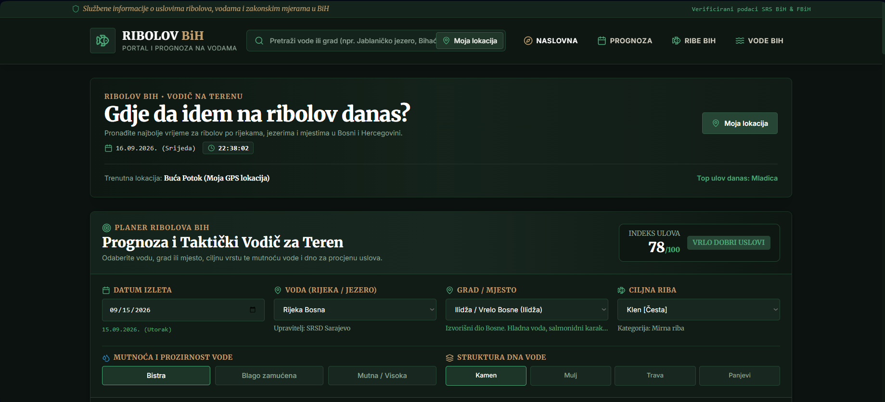
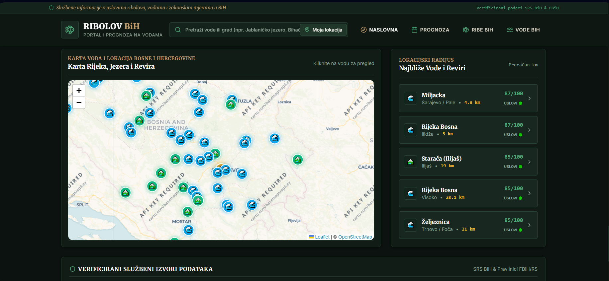

# Ribolov BiH — Bosnia and Herzegovina Fishing Assistant

## Live Demo
[YOUR_LIVE_DEMO_LINK]

## Screenshots





## Features
- Fishing assistant for rivers and lakes across Bosnia and Herzegovina
- Real-time weather data using Open-Meteo Weather API
- Geocoding and location-based weather information
- Fishing condition score from 0–100 for individual fish species
- Atmospheric pressure and 6-hour pressure trend analysis
- Solunar and astronomical calculations using SunCalc
- Moon phase and seasonal fishing conditions
- Fishing recommendations based on temperature, wind, cloud cover and precipitation
- Local database of Bosnian rivers, lakes and freshwater fish species
- Interactive maps using Leaflet
- Fishing regulations, minimum sizes and closed seasons
- Responsive design optimized for desktop and mobile devices

## Tech Stack
- Next.js 14+ (App Router)
- TypeScript
- Tailwind CSS
- Lucide React
- Open-Meteo Weather API
- Open-Meteo Geocoding API
- SunCalc
- Leaflet & React-Leaflet
- JSON-based local data
- Supabase / PostgreSQL (database schema prepared)

## Fishing Score
The application calculates a fishing score from 0–100 based on multiple environmental factors:

- Air temperature and species preferences
- Atmospheric pressure and pressure trends
- Time of day and solunar periods
- Wind and cloud cover
- Precipitation
- Season and moon phase

The score is calculated individually for each fish species based on its specific preferences.

## Data
The application includes locally maintained data for:
- 20+ freshwater fish species found in Bosnia and Herzegovina
- Major rivers and lakes with GPS coordinates
- Fish species associated with individual waters
- Sources used for fish and water information
- Fishing regulations, minimum sizes and closed seasons

Data is stored in JSON files inside the `data/` directory and can be migrated to PostgreSQL using the provided Supabase schema.

## Project Structure

```text
data/
├── fish.json
├── waters.json
├── relations.json
├── sources.json
└── rules.json

supabase/
└── schema.sql
```

## What I Learned
- Building a location-based application with Next.js and TypeScript
- Working with real-time weather APIs
- Implementing astronomical and solunar calculations
- Creating a fishing condition scoring algorithm
- Working with interactive maps using Leaflet and React-Leaflet
- Structuring domain-specific data using JSON
- Preparing a PostgreSQL database schema with Supabase
- Building responsive interfaces for desktop and mobile devices

```
